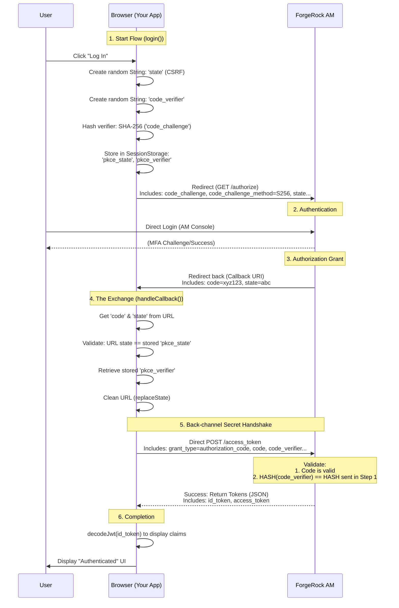
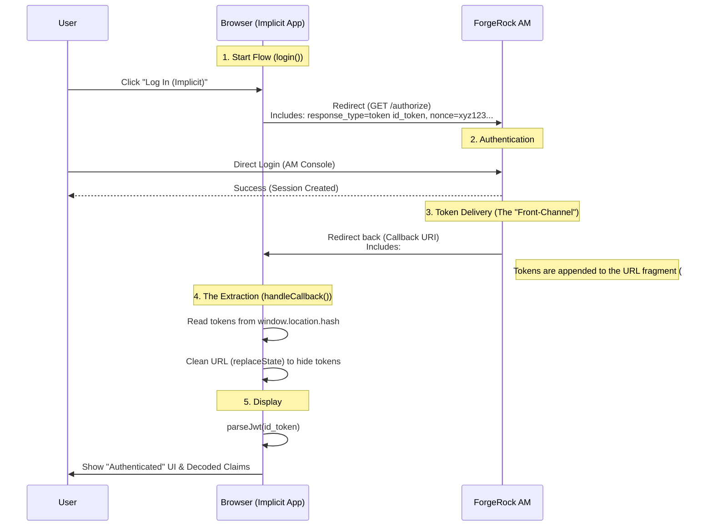

# ping-am-samples

A collection of sample applications and configurations demonstrating integration with Ping Identity Access Management AM.

## Overview

This repository contains various sample applications and configuration files that demonstrate how to integrate with Ping Identity Access Management products. The samples include authentication flows, container configurations, and client applications that showcase different aspects of Ping AM functionality.

## Repository Structure

```
ping-am-samples/
├── Docker/                            # Docker configuration and containerization samples
│   ├── Dockerfile                     # Dockerfile for building container images
│   ├── amster-config/                 # AMster configuration files
│   ├── ds-install.sh                  # Directory Server installation script
│   └── startup.sh                     # Startup script for container initialization
├── spa-for-oauth2-pkce/               # Single Page Application demonstrating OAuth 2.0 PKCE flow
│   └── index.html                     # Main HTML file for the SPA
├── spa-for-oauth2-implicit/           # Single Page Application demonstrating OAuth 2.0 Implicit flow
│   └── index.html                     # Main HTML file for the SPA
├── backendapp-for-oauth2-code-grant/  # Backend Application demonstrating OAuth 2.0 Code grant flow
│   └── server.js                      # Backend logic
└── README.md                          # This file
```

## Components

### Docker Directory

The `Docker/` directory contains all necessary files to containerize Ping AM environments:

- **Dockerfile**: Defines the base image and configuration for the container
- **amster-config/**: Configuration files for AMster (Ping Identity's automation tool)
- **ds-install.sh**: Script for installing and configuring the Directory Server
- **startup.sh**: Initialization script that runs when the container starts

## OAuth2 Grant types examples

### OAuth2 Authorization Code with Proof Key for Code Exchange (PKCE)

The `spa-for-auth2-pkce/` directory contains a single-page application that demonstrates:

- OAuth 2.0 Authorization Code flow with PKCE (Proof Key for Code Exchange)
- Client-side authentication with Ping AM
- Modern web application integration patterns



### OAuth2 Implicit flow (legacy)

The `spa-for-oauth2-implicit/` directory contains a single-page application that demonstrates:

- OAuth 2.0 Implicit Flow: A legacy grant type where tokens are delivered directly to the browser via the URL fragment.

- OIDC (OpenID Connect) Integration: Requesting and decoding an id_token alongside an access_token in a single request.

- Legacy Web Application Patterns: Demonstrating how "Public Clients" functioned before the standardization of PKCE for browser-based apps.



### OAuth2 Authorization Code

The `backendapp-for-oauth2-code-grant/` directory contains a Node.js server-side application that demonstrates:

- OAuth 2.0 Authorization Code Flow: The gold standard for "Confidential Clients" where the exchange of the authorization code for tokens happens securely on the server.

- Confidential Client Authentication: Uses a client_id and client_secret with the client_secret_basic authentication method (credentials sent via HTTP Authorization header).

- Session Management: Implementation of express-session to maintain user state and store tokens securely on the server-side, away from the browser.
## Getting Started

### Prerequisites

- Docker installed on your system
- Basic understanding of containerization concepts
- Familiarity with Ping Identity products and OAuth 2.0 flows

### Building and Running

#### Docker Container

1. Navigate to the Docker directory:
   ```bash
   cd Docker
   ```

2. Build the Docker image:
   ```bash
   docker build -t ping-am-sample .
   ```

3. Run the container:
   ```bash
   docker run -p 8080:8080 ping-am-sample
   ```

#### Single Page Application

1. Serve the SPA using a local web server:
   ```bash
   cd spa-for-auth2-pkce
   # Using Python (if available)
   python -m http.server 8000
   # Or using Node.js
   npx serve .
   ```

2. Open your browser and navigate to the served URL (typically `http://localhost:8000`)

## Usage Examples

### Authentication Flow

The spa-for-auth2-pkce sample demonstrates:
- Redirect-based authentication
- PKCE code challenge generation
- Token handling and storage
- User session management

### Container Configuration

The Docker samples show:
- Automated Ping AM setup
- Directory Server integration
- Environment variable configuration
- Startup script orchestration

## Configuration

### Environment Variables

When running the Docker container, you can customize behavior using environment variables:

- `PING_AM_URL`: URL of the Ping AM server
- `CLIENT_ID`: OAuth client identifier
- `REDIRECT_URI`: OAuth redirect URI
- `AUTHORIZATION_ENDPOINT`: OAuth authorization endpoint

### Customization

To customize the samples:
1. Modify the Dockerfile for different base images or configurations
2. Update the amster-config files for specific Ping AM setup requirements
3. Adjust the SPA code to match your authentication requirements

## Security Considerations

- The SPA sample is intended for demonstration purposes only
- Production implementations should follow security best practices
- Tokens should be handled securely and not exposed in client-side code
- Consider using HTTPS in production environments

## Contributing

This repository is intended to provide examples and samples. Contributions are welcome, but please ensure any contributions:
- Are well-documented
- Follow security best practices
- Don't expose sensitive information
- Include appropriate licensing information

## License

This project is licensed under the MIT License - see the LICENSE file for details.

## Support

For support with Ping Identity products and services, please contact:
- Ping Identity Support Portal
- Ping Identity Developer Community
- Official Ping Identity Documentation

## Acknowledgments

This repository provides samples and examples to help developers integrate with Ping Identity Access Management products. These examples are not official Ping Identity products but rather community-contributed samples for educational purposes.

## Version History

- **v1.0.0**: Initial release with Docker container samples and SPA authentication example
