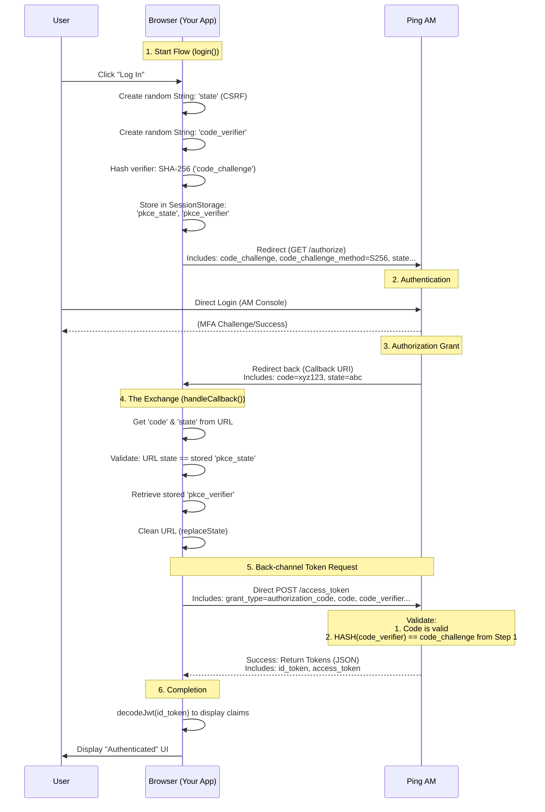
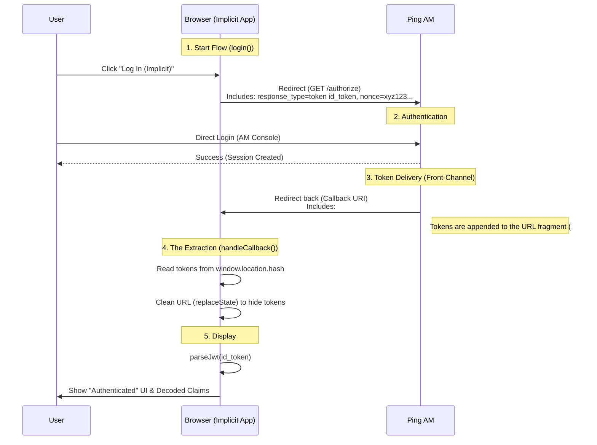
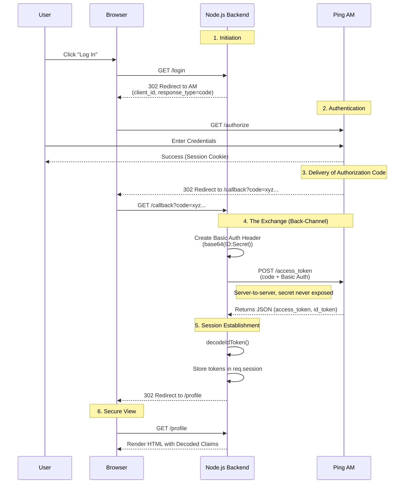

# ping-am-samples

A collection of sample applications demonstrating OAuth 2.0 and OIDC integration with Ping Identity Access Manager (AM).

## Repository Structure

```
ping-am-samples/
├── Docker/                               # Containerised Ping AM environment (Tomcat + OpenDJ)
│   ├── Dockerfile
│   ├── startup.sh
│   ├── ds-install.sh
│   └── amster-config/                    # Amster automation: OAuth clients, CORS, realm config
├── ping-websdk/                          # Embedded login SPA using ForgeRock JavaScript SDK
├── spa-for-oauth2-pkce/                  # Public client SPA — Authorization Code + PKCE
├── spa-for-oauth2-implicit-flow/         # Legacy SPA — Implicit flow (educational only)
├── backendapp-for-oauth2-code-grant/     # Confidential client — Authorization Code (Node.js)
└── android-sdk/                          # Placeholder (not yet implemented)
```

## Components

### Docker — Ping AM Container

Builds a self-contained AM instance with an embedded OpenDJ directory server. Amster runs on first boot to configure the OAuth 2.0 provider, CORS policy, and pre-registered clients.

- AM available at: `http://localhost:8080/am`
- Default admin credentials: `admin / password` (**dev only**)

### ping-websdk — ForgeRock JavaScript SDK

Webpack + TypeScript application that uses the `@forgerock/javascript-sdk` for browser-based authentication via OIDC. The dev server runs on `https://localhost:8443`.

Configuration is loaded from a `.env` file:

| Variable | Default | Description |
|---|---|---|
| `SERVER_URL` | `http://localhost:8080/am` | AM base URL |
| `REALM_PATH` | `test` | AM realm |
| `SCOPE` | `openid profile` | Requested OIDC scopes |
| `TREE` | `sdkUsernamePasswordJourney` | Authentication journey |
| `WEB_OAUTH_CLIENT` | `websdk` | Registered OAuth client ID |
| `TIMEOUT` | `3000` | SDK timeout (ms) |

### spa-for-oauth2-pkce — PKCE Single-Page App

Vanilla JS SPA demonstrating the current best practice for public browser-based clients. No server required.



### spa-for-oauth2-implicit-flow — Implicit Flow SPA (Legacy)

Demonstrates the deprecated Implicit grant type where tokens are delivered directly via the URL fragment. Included for educational and legacy-migration reference only — **do not use in new applications**.



### backendapp-for-oauth2-code-grant — Confidential Client (Node.js)

Express.js server-side application demonstrating the Authorization Code flow for confidential clients. The token exchange happens server-to-server using HTTP Basic Auth (`client_id:client_secret`). Tokens are stored in server-side sessions and never exposed to the browser.



## Getting Started

### Prerequisites

- Docker
- Node.js 18+ and npm (for `ping-websdk` and `backendapp-for-oauth2-code-grant`)

### 1. Start Ping AM

```bash
cd Docker
docker build -t ping-am-sample .
docker run -p 8080:8080 ping-am-sample
```

AM will be available at `http://localhost:8080/am` once startup completes (~2 minutes).

### 2. Run the WebSDK sample

```bash
cd ping-websdk
npm install
npm run dev
```

Open `https://localhost:8443` in your browser.

### 3. Run the backend Authorization Code sample

```bash
cd backendapp-for-oauth2-code-grant
npm install
node server.js
```

App available at `http://localhost:3001`.

### 4. Serve the PKCE or Implicit SPA

```bash
cd spa-for-oauth2-pkce
npx serve .
```

Open `http://localhost:3000` in your browser.

## Port Reference

| Component | URL |
|---|---|
| Ping AM | `http://localhost:8080/am` |
| WebSDK dev server | `https://localhost:8443` |
| Backend (code grant) | `http://localhost:3001` |
| SPAs (via `serve`) | `http://localhost:3000` |

## Security Notes

- Default credentials (`admin/password`) and pre-shared secrets are for local development only.
- The Implicit flow sample is provided for educational purposes — it is deprecated by [RFC 9700](https://datatracker.ietf.org/doc/html/rfc9700). Use PKCE for new browser-based applications.
- In production, use HTTPS, rotate secrets, and store tokens server-side.
